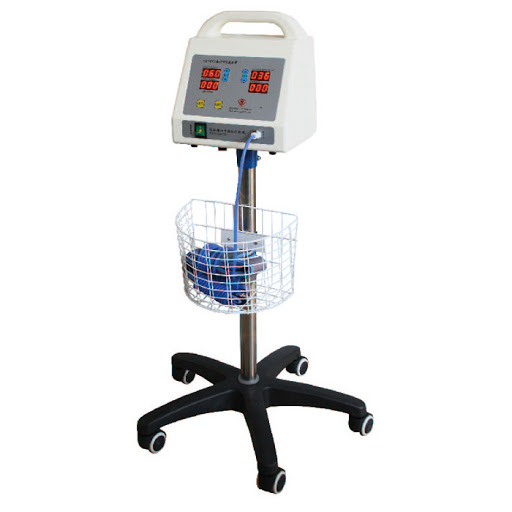

# digital torniquet
customer: [raeensanat torniquet](https://raeensanat.com/product/%D8%AF%D8%B3%D8%AA%DA%AF%D8%A7%D9%87-%D8%AA%D9%88%D8%B1%D9%86%DB%8C%DA%A9%D8%AA-%D8%AF%DB%8C%D8%AC%DB%8C%D8%AA%D8%A7%D9%84-%D9%85%DB%8C%DA%A9%D8%B1%D9%88-%D8%A8%DB%8C%D8%B3/)

A tourniquet is a constricting or compressing device used to control venous and arterial circulation to an extremity for a period of time. Pressure is applied circumferentially to the skin and underlying tissues a limb; this pressure is transferred to the vessel wall causing a temporary occlusion.

There are a number of commercially available tourniquets available for pre-hospital and hospital patients of exsanguinating extremity trauma. While there are potential risks involved in the utilization of tourniquets, expeditious and clinically appropriate application in the presence of potentially life threatening hemorrhage is in keeping not only with the standards of medical professionals, but accordingly so with the best interests of the patient. 

